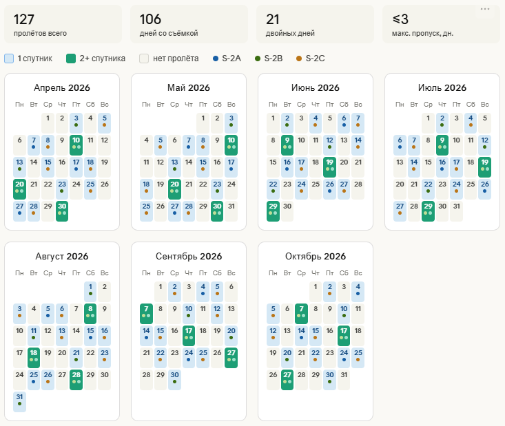

# Sentinel-2 Pass Predictor

Веб-приложение для прогнозирования дат пролётов спутников Sentinel-2 над произвольной областью интереса (AOI). Работает полностью в браузере — никакого сервера, никакой установки.

**[→ Открыть приложение](https://noaakwey.github.io/Sentinel-2-Pass-Predictor/)**



---

## Как это работает

1. Вы выгружаете исторический CSV-список пролётов из GEE или Copernicus Browser
2. Загружаете файл в приложение
3. Указываете нужный период и часовой пояс
4. Приложение рассчитывает орбитальный цикл каждого спутника по каждому треку и экстраполирует вперёд
5. Результат — интерактивный календарь + CSV для скачивания

**Точность метода:** алгоритм определяет индивидуальный цикл повторяемости (≈10 дней) для каждой пары спутник × трек съёмки и применяет медианное время пролёта. Погрешность относительно реальных архивных дат — ±0 дней (при стабильном расписании съёмки).

---

## Подготовка входного CSV в Google Earth Engine

Скопируйте скрипт в [GEE Code Editor](https://code.earthengine.google.com/), подставьте свою геометрию AOI и запустите:

```javascript
// 1. Область интереса — нарисуйте полигон на карте или задайте координаты
// var geometry = ee.Geometry.Rectangle([lon_min, lat_min, lon_max, lat_max]);

// 2. Диапазон дат — от начала архива до сегодня
var startDate = '2017-01-01';
var endDate   = '2026-05-23';  // сегодняшняя дата

// 3. Загружаем коллекцию и фильтруем по AOI и датам
var s2 = ee.ImageCollection('COPERNICUS/S2_HARMONIZED')
  .filterBounds(geometry)
  .filterDate(startDate, endDate);

// 4. Преобразуем в таблицу с нужными полями
var table = ee.FeatureCollection(
  s2.map(function(image) {
    var dt = ee.Date(image.get('system:time_start'));
    return ee.Feature(null, {
      date:      dt.format('YYYY-MM-dd'),
      time_utc:  dt.format('HH:mm:ss'),
      satellite: image.get('SPACECRAFT_NAME')
    });
  })
);

// 5. Проверяем количество строк
print('Всего снимков:', table.size());
print('Пример строк:', table.limit(10));

// 6. Экспортируем в Google Drive → папка «Drive» → файл Sentinel2_AOI_list.csv
Export.table.toDrive({
  collection:  table,
  description: 'Sentinel2_AOI_list',
  fileFormat:  'CSV',
  selectors:   ['date', 'time_utc', 'satellite']
});
```

После запуска задача появится во вкладке **Tasks** → нажмите **Run** → файл появится в Google Drive.

---

## Альтернатива: Copernicus Browser

1. Откройте [browser.dataspace.copernicus.eu](https://browser.dataspace.copernicus.eu/)
2. Нарисуйте AOI на карте
3. В панели поиска: Data source → **Sentinel-2**, укажите даты
4. Нажмите **Search** → в результатах **Export results → CSV**

---

## Формат входного файла

CSV должен содержать три колонки (порядок и регистр заголовков не важны):

```
date,time_utc,satellite
2023-04-01,07:54:28,Sentinel-2A
2023-04-04,08:04:26,Sentinel-2A
2023-04-06,07:54:32,Sentinel-2B
...
```

| Колонка | Формат | Пример |
|---|---|---|
| `date` | YYYY-MM-DD | `2024-06-15` |
| `time_utc` | HH:MM:SS | `07:54:28` |
| `satellite` | Sentinel-2A / 2B / 2C / 2D | `Sentinel-2B` |

Минимальный рекомендуемый объём — **50+ строк** (≥ полгода наблюдений) для надёжного определения цикла.

---

## Чтение результатов календаря

| Цвет ячейки | Значение |
|---|---|
| Синяя | Пролёт одного спутника |
| Зелёная | Пролёты двух и более спутников в один день |
| Серая | Нет пролётов |

Цветные точки внутри ячейки указывают на конкретный спутник. При наведении курсора отображается точное время в UTC и местном часовом поясе.

---

## Технический стек

- **React 18** (через CDN, без сборки)
- **Babel Standalone** — компиляция JSX в браузере
- **IBM Plex Mono** — шрифт
- Чистый HTML/CSS/JS — один файл `index.html`, никаких зависимостей для деплоя

---

## Лицензия

Apache-2.0 license
